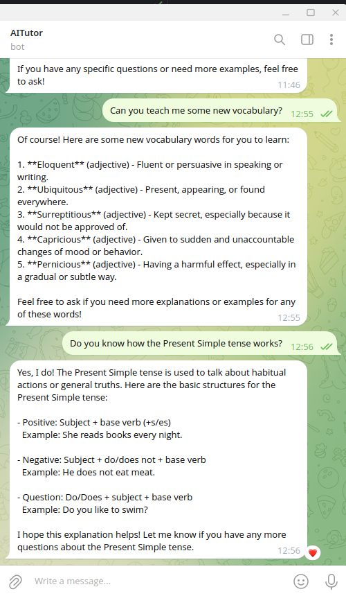

# AiTutor — Your English Language AI Companion

AiTutor is a smart, Telegram-based English learning assistant. It acts like a personal tutor and conversational partner, helping users improve their grammar, vocabulary, and confidence through natural dialogue.

## 🧠 Key Features

- 📚 **Grammar Support** — Ask about any grammar topic (e.g., Present Simple, Past Perfect), and AiTutor explains it clearly with structures and examples.
- 💬 **Conversational Learning** — Practice English in natural dialogue instead of boring drills.
- 🔎 **Contextual Responses** — Uses a knowledge base to generate accurate, relevant answers.
- 👤 **Personal Feel** — Not just a Q&A bot — it feels like a supportive, friendly tutor.

## ⚙️ Tech Stack

- **OpenAI (GPT-4)** — Natural language understanding & generation
- **LangChain** — Modular orchestration of RAG pipelines
- **ChromaDB** — Embedded vector database for fast retrieval
- **Telegram Bot API** — User interaction
- **Redis + saq** — Asynchronous task queuing
- **PostgreSQL + SQLAlchemy** — User data persistence

## 🧩 RAG Architecture

AiTutor uses a **Retrieval-Augmented Generation (RAG)** setup. When users ask about grammar topics, the system:

1. Embeds and stores curated grammar knowledge into **ChromaDB**
2. Retrieves relevant documents using **LangChain's retriever**
3. Augments GPT's response with contextual grammar snippets

This results in **more accurate and personalized replies**, especially on technical grammar topics.

## 🛠️ How It Works

- Incoming user question → checked for grammar topic
- If grammar-related → relevant data retrieved from ChromaDB
- GPT-4 receives user input + grammar snippet as context
- Final answer crafted and returned to user

## 🖼️ Example Interaction

## 🚀 Running Locally

1. Clone the repo `git clone`

2. Set up `.env` with your API keys and Telegram credentials

3. Run the bot `docker-compose up --build`

4. In a separate terminal, generate vector data:  
`docker exec -it your_container_name python rag/ingest.py`
## 📌 Status

✅ MVP Complete  
🧪 Currently experimenting with RAG improvement and personality tuning  

---

Built with ❤️ by Almas Giniatullin  
[Telegram](https://t.me/ginalmas) 